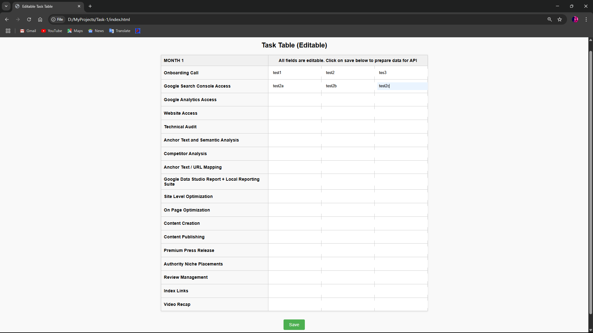
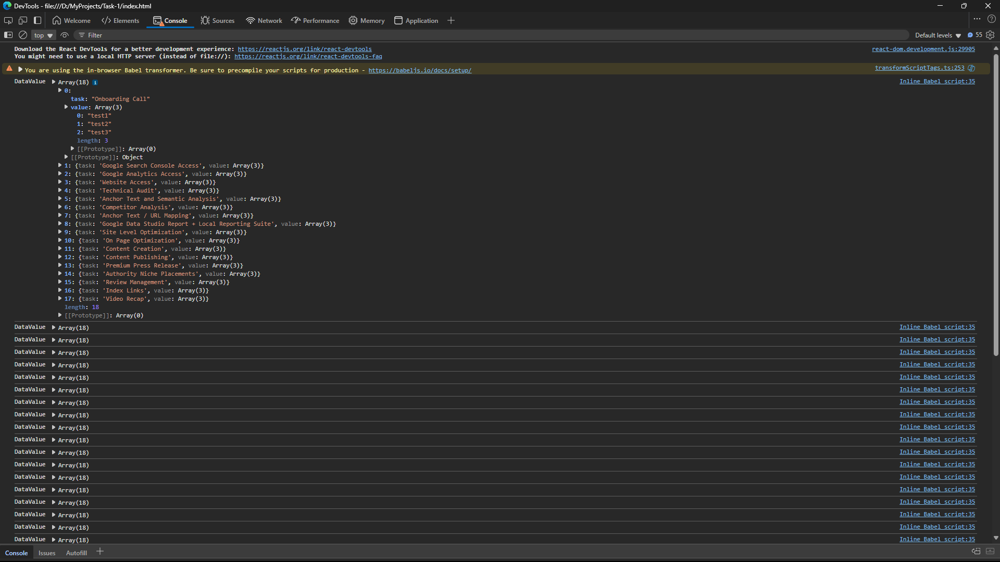

# Editable Task Table (React via CDN)

This is a simple task tracking table I built using React without using create-react-app or any build tools. It’s part of a frontend assessment I received.

The idea was to display a table where each row represents a task, and the cells are editable. Once edited, the data is stored in state and logged in the console on clicking the Save button — simulating an API-ready format.

---

## ✨ Features

- React loaded via CDN (no npm, no build tools)
- Clean and editable table layout
- Data tracked using React state
- One-click save to view structured data
- No backend — just frontend-focused as per requirements

---

## 💡 How to Run

1. Clone this repo
2. Open `index.html` in your browser
3. Edit any cell
4. Click "Save" — open the browser console to see the updated data

---

## 📷 Screenshot

*(screenshot image is here)*

---

## 📁 Files

- `index.html` → main project file with all code
- `index.css` →  external styles sheet
- `README.md` → you're reading it 🙂

---

## 🙋‍♂️ About Me

I'm Sumit Raj, a React developer working with React, HTML, CSS, JavaScript, TypeScript and other aligned technology .  
If you'd like to connect, here's my GitHub: [@SumitRaj0](https://github.com/SumitRaj0)

---

Thanks for checking this out!
